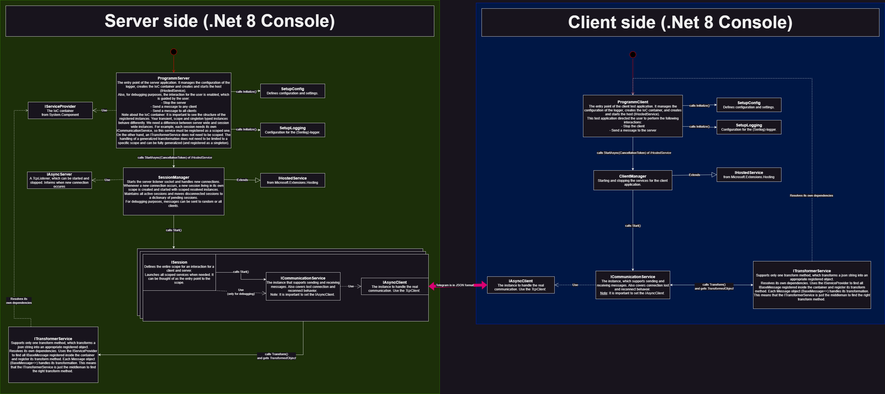

# Introduction
Building robust client-server applications in C# can be a challenging yet rewarding endeavor, especially when dealing with asynchronous communication over TCP/IP. When I first approached this task, I encountered various pitfalls such as race conditions, deadlocks, and inefficient resource management.
In this tutorial, I will guide you through the process of building a well-structured server and client console application using C# and .NET. My focus will be on establishing asynchronous TCP/IP communication between these two components, resulting in an efficient and scalable system. I will cover everything from setting up the project structure to implementing asynchronous communication, handling multiple client connections, and applying best practices for error handling and resource management.
Whether you're an experienced C# developer looking to improve your networking skills, or a novice who wants to understand the intricacies of client-server architecture, this guide will provide you with practical insights and a solid foundation for your future projects.
By the end of this tutorial, you'll have the knowledge to build your own robust, asynchronous client-server applications in C# with confidence. Let's dive in and turn the complexities of networking into a series of clear, manageable steps.

# What you will learn
You will learn how to create a well-structured server and client console application that communicates asynchronously over TCP/IP.
You will also learn how to
- Use the IoC container ([.Net Dependency Injection](https://learn.microsoft.com/en-us/dotnet/core/extensions/dependency-injection))
- Use `TcpClient` from the .Net Sockets framework and create asynchronous communication between client and server.
- Create asyncron running sessions on the server to identify an identical client/server interaction and keep separate logs.
- Learn to use Microsoft.Extentions such as `IHostedService` within the hosting framework.
- How to configure a project in .Net
- How to use Serilog framework and make clean generalized logging for server and client
- Clean architecture of a system and projects
- How to write clean code
- Unit test your applications and dlls
- How to write documentation for your system architecture

# The first idea
Before diving into the code, every great software project often begins with a simple sketch on paper. This approach allows us to visualize the system's architecture and components, which helps us identify potential challenges and solutions early in the development process.
For this tutorial, our journey began with a rough sketch that outlined the core components of our client-server system. This initial brainstorming session on paper laid the foundation for what would become a robust, asynchronous application using C# and .NET.
Our initial idea was to create a server that could handle multiple client connections simultaneously, with clients communicating asynchronously. The paper sketch revealed a structure with several key components:

- App: The main application container, responsible for IoC configuration and setup.
- Session Manager: A critical component for handling multiple client sessions.
- Services: Generic services for handling various server functions.
- Sessions: Individual client connections managed by the session manager.

We envisioned clients connecting to the server via TCP/IP, using JSON for data exchange. This initial concept aimed to create a modular, scalable system that could efficiently manage multiple client interactions without sacrificing performance.
As with many first ideas, this sketch served as a starting point. It helped us identify the core components and their relationships, setting the stage for more detailed planning and eventual implementation.
In the following sections, we'll explore how this initial idea evolved, the challenges we encountered, and the solutions we developed as we brought this concept to life in C# code.

As we delved deeper into our initial concept, several critical questions emerged that challenged us to refine our approach:

1. Generalize communication:
How could we create a flexible, efficient, and scalable structure for messaging objects between the server and clients? The goal was to create a system where adding a new message type would be as simple as creating the object and registering it. This led to the concept of the `ITransformerService`, which would handle the transformation and routing of these generalized message objects.
2. True asynchronous communication:
What does true asynchronous communication entail and what are the challenges? We needed to understand the potential risks and problems associated with asynchronous operations, such as race conditions, deadlocks, and ensuring proper resource management.
3. Session isolation and shared services:
How could we give each client session its own scope, allowing it to run independently of other sessions, while still providing access to shared, generalized services? This question went to the heart of our architecture, challenging us to balance isolation with efficiency.

These questions led us to develop our initial sketch into a more sophisticated design. We realized that our first idea, while a good starting point, needed refinement to address these complex issues.
The concept of the `ITransformerService` emerged as a potential solution to our first question, promising a flexible way to handle different message types. For asynchronous communication, we knew we'd have to dive deep into C#'s async/await patterns and carefully consider our approach to multithreading.
The challenge of session isolation with shared services led us to explore advanced dependency injection techniques and consider how we could structure our application to maintain clear boundaries while allowing necessary interactions.
As we moved forward, these questions shaped our development process, pushing us to create a more robust and flexible system than our initial sketch suggested. In the following sections, we'll explore how we overcame each of these challenges and turned our initial idea into a full-fledged, efficient client-server application.

# Development Journey
The journey from our initial sketch to the final implementation underscores a fundamental truth about software development: the evolution of a software system is an iterative process of sketching, building, breaking, refactoring and starting over again. This cycle isn't just normal; it's essential to creating robust, efficient, and maintainable software.

***Requirements analysis:*** The process begins with understanding user needs and translating them into detailed specifications. This includes identifying both functional requirements, which define what the system should do, and non-functional requirements, which address how the system performs its functions. This fundamental step ensures that our development efforts are aligned with user expectations and business goals.

> **_Note:_** For this tutorial project, our specific requirements are: We'll ensure that interactions are efficient and non-blocking. Our system will seamlessly handle concurrent client connections. We'll focus on modularity and maintainability using Inversion of Control principles. We'll write tests to verify the reliability and correctness of our code. Include logging, error handling, and other essential features.

These requirements form the foundation of our project and guide our design and implementation decisions. 

***High-level design (Sketching):*** Sketching allows us to quickly explore ideas without the constraints of code. It's where creativity flows freely and we can envision the big picture. In this phase, we define the overall architecture and identify key components and modules. High-level diagrams, such as UML diagrams, help visualize the structure of the system and address important factors such as scalability, maintainability, and performance. Our initial paper sketch sets the stage for multiple iterations as we refine our concept.

> **_Note:_** [See the hand-drawn graphic in the previous chapter.](#the-first-idea)

***Detailed Design (Building):*** Building is where our ideas take shape in code. This phase involves breaking down the system into smaller, more manageable components and specifying interfaces, data structures, algorithms, and interactions. Detailed design includes creating class diagrams, sequence diagrams, and other views that provide a comprehensive understanding of the system. It's exciting to see concepts come to life, but it's also where we encounter unexpected challenges. Each build taught us something new about the behavior and performance of our system.

> **_Note:_** [See How it really works](#how-it-really-works)

***Implementation (Building):*** With the detailed design as our blueprint, we begin to write the code. Adherence to coding standards and best practices is critical to ensuring that our implementation is reliable and maintainable. This phase is characterized by the transformation of theoretical designs into functional software components.

> **_Note:_**  [See the ITransformerService example.](#asynchronous-communication-and-operations) 

***Testing and Validation (Breaking):*** Breaking may sound negative, but it's a critical part of the process. By pushing our system to its limits, we discover weaknesses in our design. Every "break" is an opportunity to learn and improve. This phase involves rigorous testing of individual components and the integrated system. We stress test our asynchronous communication, challenge our message transformation system, and scrutinize our session management. Identifying and fixing bugs is essential to ensuring that the software meets its specifications and performs reliably.

***Refactoring:*** Refactoring is the art of improving code without changing its external behavior. As we have implemented our ideas, we have continually reviewed and restructured our code. This process helps us address challenges and optimize the system for readability, maintainability, and performance. Continuous improvement is the key to creating a quality software product.

***Iterate:*** Starting over doesn't mean throwing everything away. Instead, it's about taking the lessons learned from each iteration and applying them to create a better version of our system. This cyclical process has taken us from our first rough sketch to a sophisticated, efficient client-server application. Sometimes this means major architectural changes, other times subtle tweaks.

This iterative approach of sketching, building, breaking, refactoring and starting over is essential to developing robust software. It teaches us that software development is not a linear path, but a series of explorations, discoveries, and improvements. As we progress through this tutorial, we'll keep in mind that the final system we build is the result of many iterations, each of which refines and improves upon the last. This approach not only produces better software, but also helps us grow as developers, constantly learning and adapting to new challenges.

There is so much more to say about designing software, but to avoid dragging this tutorial out into infinity, let's move on to the next section.

# How it really works

## Overview of the Architecture

The architecture of our application follows a client-server model, which is a common design pattern in software development. This model separates the system into two main components: the client and the server. Each component has distinct responsibilities and interacts with the other to provide a seamless user experience.

***What both apps do:***
`ProgramServer` and `ProgramClient` manages configuration, logger, and lifecycle of ``IHostedService``. ``SetupConfig`` and ``SetupLogging`` define configurations and logging setup.

***Server Side:***
``SessionManager`` handles connections and sessions. ``IAsyncServer`` manages connections. 

***Client Side:***
IClientManager manages client services.

***Shared:***
``ICommunicationService`` and ``IAsyncClient`` handle message transmission and connection management. ``ITransformerService`` transforms JSON strings to objects automatically depending on the object type (`"$type"`).

### How IoC Works

In our application, we use the Inversion of Control (IoC) principle to manage dependencies and promote a more modular and testable codebase. IoC is implemented using Dependency Injection (DI), which allows us to inject dependencies into classes rather than having classes create their own dependencies. This approach decouples the creation of objects from their use, making the code more flexible and easier to maintain.

To learn more about how IoC and DI work in .NET, you can refer to the official documentation:
- [Dependency Injection in .NET](https://learn.microsoft.com/en-us/dotnet/core/extensions/dependency-injection)
- [Service Lifetimes](https://learn.microsoft.com/en-us/dotnet/core/extensions/dependency-injection#service-lifetimes)

### Configuring a .NET Console App

Configuring a .NET console application involves setting up various configuration sources, such as JSON files, environment variables, and command-line arguments. This allows the application to read configuration settings from multiple sources and use them at run time. The configuration system in .NET is very flexible and can be customized to meet the needs of the application.

For detailed instructions on how to configure a .NET console application, you can refer to the official documentation:
- [Configuration in .NET](https://learn.microsoft.com/en-us/dotnet/core/extensions/configuration)
- [Configuration in .NET Console Applications](https://learn.microsoft.com/en-us/dotnet/core/extensions/configuration-providers#json-configuration-provider)
- [Options Pattern in .NET](https://learn.microsoft.com/en-us/dotnet/core/extensions/options)

### Using Serilog for Logging

Serilog is a popular logging library for .NET that allows you to create structured log files and log to various outputs, including the console. By using Serilog, you can separate logs for each session and ensure that logs are written in a structured format that is easy to query and analyze.

To get started with Serilog and learn how to configure it for your application, you can refer to the following resources:
- [Serilog Documentation](https://serilog.net/)
- [Serilog GitHub Repository](https://github.com/serilog/serilog)
- [Serilog Map Sink](https://github.com/serilog/serilog-sinks-map)
- [Serilog Console Sink](https://github.com/serilog/serilog-sinks-console)
- [Serilog File Sink](https://github.com/serilog/serilog-sinks-file)

## Client-Side Implementation
*[In development... How to really use the full magic of asyncron communication on UI side](#todos)* 
## Server-Side Implementation
## Asynchronous Communication and Operations

In this section, we will delve into the details of our system's asynchronous communication and operations. We'll cover the components and their interactions, focusing on how they work together to create a seamless, efficient communication system. The guiding principle behind these components is to maintain small, focused interfaces while encapsulating deep logic and hiding as much irrelevant information as possible.

### An Overview of the Components and their Interaction

The image above provides a visual representation of how our key components interact. Let's break down each component and its role in the system.

### The `ITransformerService`
The ITransformerService is a critical component in our system, responsible for transforming messages between different formats or types. The main features of this service are

- Self-resolving dependencies: The ITransformerService uses the IServiceProvider to dynamically resolve its required dependencies. This approach allows for greater flexibility and easier testing.
- Reflection-based method discovery: Uses reflection to find the appropriate transform method for each message type. This powerful feature allows the service to handle new message types without requiring changes to its core logic.
- Caching for performance: When the service is first resolved, it registers all type mappings and caches its method information. This optimization ensures that we only need to perform potentially expensive reflection operations once, improving overall performance.
- Handling of BaseMessage objects: Each message object (derived from BaseMessage) is processed through its transformation pipeline. The TransformerService acts as an intermediary, finding and calling the correct transform method for each specific message type.

### The `ICommunicationService`
The ICommunicationService is the central hub for message handling in our system. Its main tasks include

- Sending and receiving messages: This service supports both sending and receiving messages asynchronously.
- Event-based communication: It registers with the MessageReceived event of the IAsyncClient and provides a thread-safe delegate for all ungrabbed TransformedObjects.
- Automatic transformation: When a message is received, the ICommunicationService automatically uses the ITransformerService to transform the message into the appropriate object type.
- Asynchronous operations: Both sending and receiving operations are handled asynchronously, ensuring that our application remains responsive even when dealing with high message volumes or network latency.

### The `IAsyncClient`

The IAsyncClient is our low-level communication interface. Its main features are:

- Asynchronous receiving loop: It implements an asynchronous loop for receiving messages, ensuring that message reception doesn't block other operations.
- Event-based notification: When a new message is received, it raises an event asynchronously, allowing other components (particularly the ICommunicationService) to react to new messages without polling.
- Connection management: It provides events for connection status changes, such as when a connection is lost, allowing the system to respond appropriately to network issues.
- Abstraction of underlying technology: By using an interface, we abstract away the details of the actual network communication (in this case, TcpClient), making it easier to change or mock the network layer for testing.

### Putting all togehter
The interaction of these components creates a robust asynchronous communication system:

- The IAsyncClient constantly listens for incoming messages.
- When a message is received, it notifies the ICommunicationService.
- The ICommunicationService uses the ITransformerService to transform the raw message into the appropriate object type.
- The transformed message is then made available to the rest of the application, either through events or by releasing waiting tasks.

This design allows for efficient, scalable communication while maintaining a clear separation of concerns. The use of asynchronous operations throughout ensures that our application remains responsive even when dealing with high volumes of messages or complex transformations.
By using dependency injection, reflection, and event-driven programming, we've created a flexible system that can easily accommodate new message types and communication patterns without requiring significant changes to the core architecture.

### Risks and Challenges of Asynchronous Programming

1. **Increased Complexity**:
   - Writing, reading, and debugging asynchronous code can be more challenging compared to synchronous code. The non-linear flow of execution makes it harder to reason about behavior.

2. **Potential for Race Conditions**:
   - When multiple asynchronous operations run concurrently, race conditions may occur due to uncontrollable timing. These bugs can be subtle and hard to reproduce.

3. **Deadlocks**:
   - Improper use of `async/await`, especially combined with synchronous waits, can lead to deadlocks where tasks wait for each other indefinitely.

4. **Context and Synchronization Issues**:
   - Asynchronous operations may complete on different threads than where they started. This can cause problems with thread-specific data or UI interactions.

5. **Error Handling Complexity**:
   - Exception handling in asynchronous code can be challenging, as exceptions might occur in a different context from where the async operation began.

6. **Overuse of Asynchronous Programming**:
   - Not every operation needs to be asynchronous. Overusing `async/await` for simple tasks can lead to unnecessary overhead and complexity.

7. **Testing Difficulties**:
   - Asynchronous code requires testing various timing scenarios to ensure robustness.

8. **Performance Overhead**:
   - While beneficial for I/O-bound tasks, asynchronous programming introduces some overhead. For very short tasks, this overhead might outweigh the benefits.

9. **Callback Hell**:
   - Deeply nested asynchronous operations can still lead to hard-to-follow code, even with C#'s `async/await` syntax.

10. **Resource Management**:
    - Properly disposing of resources in asynchronous operations can be tricky, especially with long-running or nested async tasks.

To mitigate these risks, consider the following strategies:
- **Separation of Concerns**: Organize code to manage complexity.
- **Locking and Synchronization**: Use carefully to avoid issues.
- **Exception Handling**: Handle exceptions properly in async methods.
- **Judicious Use**: Only apply asynchronous programming where it provides clear benefits.
- **Comprehensive Testing**: Thoroughly test async code, including stress tests.

# And that's why we do this

# Statistics

# Limitation

# Conclusion 

# Todos

- Security Considerations
    1. Authentication and uthorization
    2. Data Protection

- How to really use the full magic of asyncron communication on UI side.

- Deployment
    1. Deployment process
    2. Continuous Integration/Continuous Deployment (CI/CD)

- Looking in the future: Dockerize
